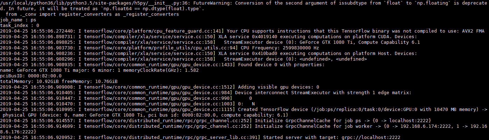

# 手写体识别的一个工程,改写为tensorflow分布式

    分别采用神经网络模型和cnn模型,目前使用的是图间复制和异步模式。

## 各目录情况如下：

### datas：

    存储训练（含测试）、预测图片集

### parameter_set:

    固定路径及训练超参数的设置

### data_pre：

    手写体识别第一步：数据预处理过程，将图片转化为tensorflow特有的tfrecord文件格式

### model_define:

    目录下cnn.py：cnn卷积网络模型结构
    目录下network.py：神经网络模型结构

### models:

    分别存放神经网络和cnn网络生成的模型文件

### train_models:

    手写体识别第二步：模型训练过程
    目录下readdata.py完成生成训练、测试的batch数据功能
    目录下train.py神经网络模型或cnn模型的训练过程
    目录下train_network.py与train_cnn.py分别为神经网络模型或cnn模型调用train.py的训练过程，依据一个bool值（networkmodel）判断属于哪个模型

### predicts:

    手写体识别第三步：神经网络模型或cnn模型的预测过程

## 运行过程示例（如神经网络）

    1. 第一步，数据预处理过程，python3 img_to_tfrecord.py
    2. 第二步，模型训练及保存模型，
    第一台，python3 train_network.py --job_name=ps --ps_hosts=192.**.**.**:2222 --worker_hosts=192.**.**.**:2222,192.**.**.**:2222 --task_index=0
    第二台，python3 train_network.py --job_name=worker --ps_hosts=192.**.**.**:2222 --worker_hosts=192.**.**.**:2222,192.**.**.**:2222 --task_index=0
    第三台，python3 train_network.py --job_name=worker --ps_hosts=192.**.**.**:2222 --worker_hosts=192.**.**.**:2222,192.**.**.**:2222 --task_index=1

ps:

worker：

